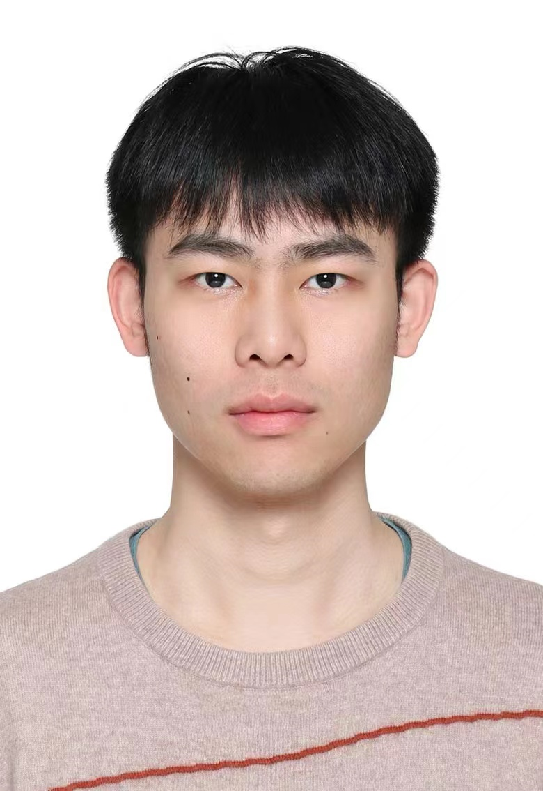

The Intelligent Communication Lab is dedicated to pushing the frontiers of research and innovation in wireless communications, networking, and machine learning. We have a dual research focus:  one dedicated to uncovering fundamental insights, and the other focused on crafting practical solutions with real-world impact. To achieve these goals, we employ a blend of traditional techniques like signal processing and interdisciplinary methods like data science.

About the Supervisor
======

<table style="width: 100%; border: 1px solid #d1d5da; border-radius: 6px; border-collapse: separate; border-spacing: 0; background: white;">
  <tr style="border-bottom: 1px solid #d1d5da;">
    <td style="padding: 20px; width: 70%;">
      <h2 style="margin: 0 0 8px 0; color: #24292e; font-size: 22px; font-weight: 600;">Dr. Yulin Shao</h2>
      
Assistant Professor

      
      

        
Department of Electrical and Electronic Engineering

      

      
      

        
The University of Hong Kong

      

      
      

        <svg width="16" height="16" viewBox="0 0 24 24" fill="none" stroke="#586069" style="margin-right: 8px;">
          <path d="M4 4h16c1.1 0 2 .9 2 2v12c0 1.1-.9 2-2 2H4c-1.1 0-2-.9-2-2V6c0-1.1.9-2 2-2z"></path>
          <polyline points="22,6 12,13 2,6"></polyline>
        </svg>
        <a href="mailto:ylshao@hku.hk" style="color: #0366d6; text-decoration: none; font-size: 14px; font-weight: 500;">ylshao@hku.hk</a>
      

    </td>
    
    <td style="padding: 20px; text-align: center; background-color: #f6f8fa; border-left: 1px solid #d1d5da;">
      

        

          
        

      

    </td>
  </tr>
</table>

<!--

  <table>
    <tr>
      <td style="vertical-align: top; padding-right: 20px;">
        <h2>Dr. Yulin Shao</h2>
        <h3>Assistant Professor</h3>
        
<strong>Department of Electrical and Electronic Engineering</strong> 
        The University of Hong Kong

        
<a href="mailto:ylshao@hku.hk">ylshao@hku.hk</a>

      </td>
      <td style="vertical-align: middle;">
        
      </td>
    </tr>
  </table>

-->

I am an Assistant Professor at the Department of Electrical and Electronic Engineering ([EEE](https://www.eee.hku.hk/)), The University of Hong Kong. I am also a Visiting Researcher at the Department of Electrical and Electronic Engineering ([EEE](https://www.imperial.ac.uk/electrical-engineering/)), Imperial College London.

Please contact me by:

> University of Hong Kong: ylshao@hku.hk

> Imperial College London: y.shao@imperial.ac.uk

I am an Editor of IEEE Communication Magazine ([ComMag](https://www.comsoc.org/publications/magazines/ieee-communications-magazine/editorial-board)), IEEE Transactions on Wireless Communications ([TWC](https://www.comsoc.org/publications/journals/ieee-twc/editorial-board)), IEEE Transactions on Communications ([TCOM](https://ieeexplore.ieee.org/xpl/RecentIssue.jsp?punumber=26)), and IEEE Communications Letters ([ComLett](https://ieeexplore.ieee.org/xpl/RecentIssue.jsp?punumber=4234)).

Please contact me by:

> IEEE:  ylshao@ieee.org

Education
------
* Ph.D. in Information Engineering, Chinese University of Hong Kong, Aug. 2016 – Dec. 2020.
* B.E. and M.E. in Communication Engineering, Xidian University, Sept. 2009 – Jan. 2016.

Work experience
------
* Imperial College London
  * Visiting Researcher, Department of EEE
    
* University of Macau
  * Assistant Professor, IOTSC State key Lab
    
* University of Exeter
  * Lecturer (AP) in Information Processing, Department of Engineering

* Imperial College London
  * Research Associate, Department of Electrical and Electronic Engineering
  
* Massachusetts Institute of Technology
  * Visiting Scholar, Claude E. Shannon Communication and Network Group
  
* Institute of Network Coding
  * Research Assistant
 
  
Research Interests
------
* Fundamentals of wireless communications
  * Tools: signal processing, matrix theory, real analysis, information theory.
* Data science and machine learning
  * Tools: deep learning, variational Bayesian methods, statistical inference.
* Networking and stochastic control
  * Tools: Markov decision process theory, reinforcement learning, optimization.

I am particularly drawn to two types of problems: 1) problems that yield fundamental insights; 2) problems that are grounded in practical applications or have practical value.

My recent research endeavors focus on: 1) exploring deep learning techniques to achieve new breakthroughs in wireless communications, networking, and control; 2) developing new designs for wireless links and networks to enhance support for machine learning applications.

Awards
------
* Best Paper Award, IEEE Wireless Communications and Networking Conference (WCNC) 2024, Dubai, United Arab Emirates.
* Best Paper Award, IEEE International Conference on Communications (ICC) 2023, Rome, Italy.
* International Telecommunication Union (ITU) AI/ML in 5G Challenge 2021, ranked third in problem “Federated learning for spatial reuse” and nominated as a finalist in the Grand Challenge Finale.
* Global scholarship programme for research excellence, 2019.
* Overseas research attachment programme, 2018.
 

Professional Services
------
* IEEE Communications Magazine, Editor.
* IEEE Transactions on Wireless Communications, Editor.
* IEEE Transactions on Communications, Editor.
* IEEE Communications Letters, Editor.
* IEEE Communication Society flagship conferences, Session chair and TPC member.
* 5G Academy Italy 2022, Guest Lecturer.
* IEEE Information Theory Society Bangalore Chapter, Invited Speaker.

Selected Journal Publications
------

* Y. Shao. DEEP-IoT: Downlink-Enhanced Efficient-Power Internet of Things, IEEE Transactions on Wireless Communications, 2024.
  
* Y. Shao, Q. Cao, and D. Gunduz. A Theory of Semantic Communication, IEEE Transactions on Mobile Computing, 2024.
  
* Y. Shao, C. Bian, L. Yang, Q. Yang, Z. Zhang, D. Gunduz, Point Cloud in the Air, IEEE Communications Magazine, 2024.

* Y. Shao, S. Liew and D. Gunduz. Denoising noisy neural networks: A Bayesian approach with compensation, IEEE Transactions on Signal Processing, 2023.

* Y. Shao, Y. Cai, T. Wang, Z. Guo, P. Liu, J. Luo, D. Gunduz. Learning-based autonomous channel access in the presence of hidden terminals, IEEE Transactions on Mobile Computing, 2023.

* Y. Shao, D. Gunduz and S. Liew. Bayesian over-the-air computation, IEEE Journal on Selected Areas in Communications, vol. 41, no. 3, pp. 589-606, 2023.

* Y. Shao, D. Gunduz and S. Liew. Federated edge learning with misaligned over-the-air computation,” IEEE Transactions on Wireless Communications, vol. 21, no. 6, pp. 3951-3964, 2022.

* Y. Shao, D. Gunduz. Semantic communications with discrete-time analog transmission: a PAPR perspective,” IEEE Wireless Communication Letter, 2022.

* Y. Shao. Goal-oriented communication system redesign for wireless collaborative intelligence, IEEE Multimedia Communication Technical Committee – Frontiers, 2022.

* Y. Shao, Q, Cao, S. Liew, and H. Chen. Partially observable minimum-age scheduling: the greedy policy, IEEE Transactions on Communications, vol. 70, no. 1, pp. 404-418, 2021.

* Y. Shao, S. Liew, H. Chen, Y. Du. Flow sampling: network monitoring in large-scale software-defined IoT networks, IEEE Transactions on Communications, vol. 69, no. 9, pp. 6120-6133, 2021.

* Y. Shao and S. Liew. Flexible subcarrier allocation for interleaved frequency division multiple access, IEEE Transactions on Wireless Communications, vol. 19, no. 11, pp. 7139-7152, 2020.

* Y. Shao, A. Rezaee, S. Liew, and V. Chan. Significant sampling for shortest path routing: a deep reinforcement learning solution, IEEE Journal on Selected Areas in Communications, vol. 38, no. 10, pp. 2234–2248, 2020.

* Y. Shao, S. Liew, and J. Liang. Sporadic ultra-time-critical crowd messaging in V2X, IEEE Transactions on Communications, vol. 69, no. 2, pp. 817-830, 2020.

* Y. Shao, S. Liew, and T. Wang. AlphaSeq: sequence discovery with deep reinforcement learning, IEEE Transactions on Neural Networks and Learning Systems, vol. 31, no. 9, pp. 3319–3333, 2019.

* Y. Shao, S. Liew, and L. Lu. Asynchronous physical-layer network coding: symbol misalignment estimation and its effect on decoding, IEEE Transactions on Wireless Communications, vol. 16, no. 10, pp. 6881–6894, 2017.
