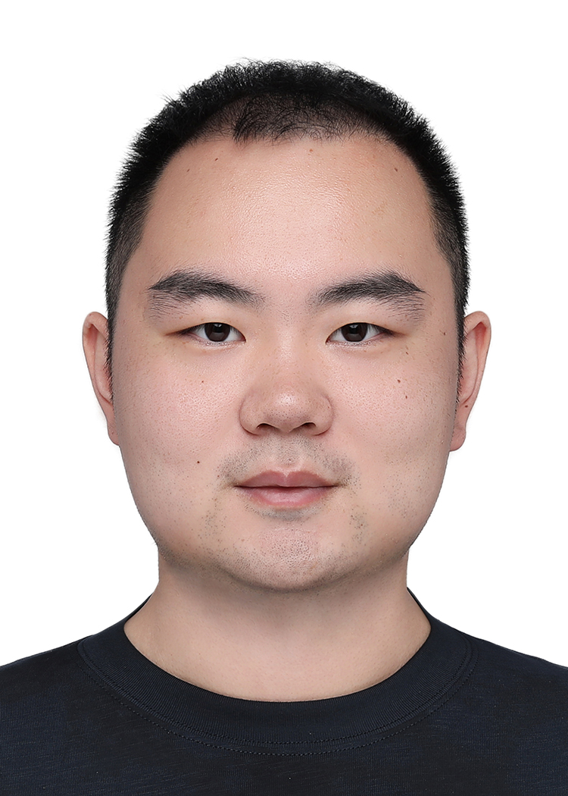
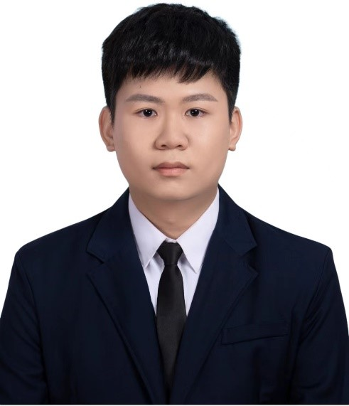
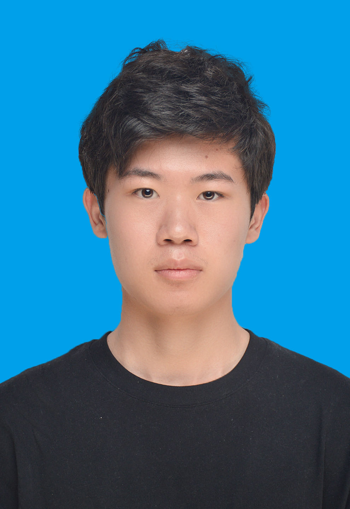
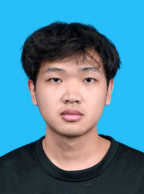

<table>
<!-- Nuofan Mao -->
  <tr>
    <td style="padding: 10px;">
      
    </td>
    <td style="padding: 10px;">
      <h2>Nuofan Mao</h2>
      
<strong>Ph.D. in Electrical and Electronic Engineering, </strong> Imperial College London (Sept. 2020 - Aug. 2025)

      
<strong>Msc in Electrical and Electronic Engineering, </strong> The University of Western Australia (July 2018 - Aug. 2020)

      
<strong>B.E. in Automation, </strong> Southwest University (Sept 2015 - June 2019)

      
<strong>Research interests: </strong> Wireless communication, optimization 

      
<strong>Email:</strong> nuofan1@outlook.com

    </td>
  </tr>
  <table>

PhD students
======

<table>
<!-- Zijian Yang -->
  <tr>
    <td style="padding: 10px;">
      
    </td>
    <td style="padding: 10px;">
      <h2>Zijian Yang</h2>
      
<strong>B.E. in Communication Engineering, </strong> Jilin University (Aug. 2019 - June 2023)

      
<strong>Research interests: </strong> Wireless communication, optimization 

      
<strong>Email:</strong> 1154572836@qq.com

    </td>
  </tr>
<!-- Yu Ding -->
<tr>
    <td style="padding: 10px;">
      
    </td>
    <td style="padding: 10px;">
      <h2>Yu Ding</h2>
      
<strong>B.E. in Data Science and Big Data Technology,</strong> Nankai University (Sept. 2019 - Jun. 2023)

      
<strong>Research interests: </strong> Data science and machine learning, signal processing, IoT 

      
<strong>Email:</strong>yuding_um@163.com

    </td>
  </tr>
  <!-- Yewen CAO -->
<tr>
    <td style="padding: 10px;">
      
    </td>
    <td style="padding: 10px;">
      <h2>Yewen CAO</h2>
      
<strong>B.E. in Communication Engineering,</strong> Harbin Institute of Technology (Sep. 2020-June 2024)

      
<strong>Research interests: </strong> wireless communications, signal processing, IoT 

      
<strong>Email:</strong>2200201101@stu.hit.edu.cn 

    </td>
  </tr>
  <!-- Enhao CHEN -->
<tr>
    <td style="padding: 10px;">
      
    </td>
    <td style="padding: 10px;">
      <h2>Enhao CHEN</h2>
      
<strong>B.E in Cyberspace Security,</strong> Harbin Institute of Technology (Sep. 2020-June 2024)

      
<strong>Research interests: </strong> IoT, Cyberspace Security, Network topology. 

      
<strong>Email:</strong>chenenhao741369@163.com 

    </td>
  </tr>
  <!-- Hongyu AN -->
<tr>
    <td style="padding: 10px;">
      
    </td>
    <td style="padding: 10px;">
      <h2>Hongyu AN</h2>
      
<strong>MSc in Electronic Science and Technology,</strong> Southern University of Science and Technology (Aug. 2021 - Jul. 2024 ) 

      
<strong>B.E in Computer Science and Technology,</strong> Harbin Institute of Technology (Aug. 2016 - Jun. 2020)

      
<strong>Research interests: </strong> Deep Learning, IoT, Signal processing. 

      
<strong>Email:</strong>12132494@mail.sustech.edu.cn 

    </td>
  </tr>  
  <!-- Dengke Wei -->
<tr>
    <td style="padding: 10px;">
      
    </td>
    <td style="padding: 10px;">
      <h2>Dengke Wei</h2>
      
<strong>B.E in Information Engineering,</strong> South China University of Technology (Sep. 2021 - Jun. 2025)

      
<strong>Research interests: </strong> Wireless Communications, IoT, Signal Processing. 

      
<strong>Email:</strong>eedengkewei@mail.scut.edu.cn 

    </td>
  </tr>  
  <!-- Huiji Jiao -->
<tr>
    <td style="padding: 10px;">
      
    </td>
    <td style="padding: 10px;">
      <h2>Huiji Jiao</h2>
      
<strong>B.E in Communication Engineering,</strong> Harbin Institute of Technology (Sep. 2021 - Jun. 2025)

      
<strong>Research interests: </strong> Wireless Communications, movable antenna. 

      
<strong>Email:</strong>1316670842@qq.com

    </td>
  </tr>  
  <!-- Tianji He -->
<tr>
    <td style="padding: 10px;">
      
    </td>
    <td style="padding: 10px;">
      <h2>Tianji He</h2>
      
<strong>B.E in Electronic Information Engineering,</strong> Huazhong University of Science and Technology (Sep. 2021 - Jun. 2025)

      
<strong>Research interests: </strong> Wireless Communications, Artificial Intelligence. 

      
<strong>Email:</strong>674438546@qq.com

    </td>
  </tr>  
  <!-- Fan Yang -->
<tr>
    <td style="padding: 10px;">
      
    </td>
    <td style="padding: 10px;">
      <h2>Fan Yang</h2>
      
<strong>MSc in Electrical and Computer Engineering,</strong> University of Macau (Aug. 2022 - Jun. 2025) 

      
<strong>B.E in Electronic Information Science and Technology,</strong> Nankai University (Aug. 2016 - Jun. 2020)

      
<strong>Research interests: </strong>  Information Theory, Artificial Intelligence. 

      
<strong>Email:</strong>mc25013@um.edu.mo

    </td>
  </tr>  
</table>

Visiting PhD students
======

<table>
  <!-- Menghan Li -->
 <tr>
    <td style="padding: 10px;">
      
    </td>
    <td style="padding: 10px;">
      <h2>Menghan Li</h2>
      
<strong>Ph.D. in Computer Application Technology,</strong> University of Chinese Academy of Sciences (Sep. 2021) 

      
<strong>B.E. in Electronic Information Engineering,</strong> Wuhan University  (Sept. 2017 - Jun. 2021)

      
<strong>Research interests: </strong> optical wireless communications, signal processing.  

      
<strong>Email:</strong> limenghan21@mails.ucas.ac.cn  

    </td>
  </tr> 
</table>

Alumni
======

<table>
  <!-- Haotian Wu@Imperial College London-->
 <tr>
    <td style="padding: 10px;">
      
    </td>
    <td style="padding: 10px;">
      <h2>Haotian Wu</h2>
      
<strong>Ph.D. in Information Processing,</strong> Imperial College London (Sep. 2021 - Jan. 2025) 

      
<strong>M.Sc in EEE,</strong> Imperial College London (Sept. 2017 - Jun. 2020) 

      
<strong>B.E. in Automation,</strong> Zhejiang University (Sept. 2013 - Jun. 2017)

      
<strong>Research interests: </strong> computer vision, communication, reinforcement learning, control theory. 

      
<strong>Email:</strong> haotian.wu17@imperial.ac.uk  

    </td>
  </tr>
  <!-- Chenghong Bian@Hong Kong University of Science and Technology -->
<tr>
    <td style="padding: 10px;">
      
    </td>
    <td style="padding: 10px;">
      <h2>Chenghong Bian</h2>
      
<strong>Ph.D. in Information Processing,</strong> Imperial College London (Sep. 2022 - Nov. 2025) 

      
<strong>M.Sc in EECS,</strong> University of Michigan (Sept. 2020 - Jun. 2022) 

      
<strong>B.E. in Mathematics and Physics,</strong> Tsinghua University (Sept. 2016 - Jun. 2020)

      
<strong>Research interests: </strong> information theory, signal processing, semantic communications.  

      
<strong>Email:</strong> c.bian22@imperial.ac.uk  

    </td>
  </tr>
    <!-- Runxin Zhang@Tsinghua University-->
<tr>
    <td style="padding: 10px;">
      
    </td>
    <td style="padding: 10px;">
      <h2>Runxin Zhang</h2>
      
<strong>Ph.D. in Computer Application Technology,</strong> University of Chinese Academy of Sciences (Sep. 2020 - June 2025) 

      
<strong>B.E. in Automation (honr.),</strong> Nanjing University of Aeronautics and Astronautics (Sept. 2016 - Jun. 2020)

      
<strong>Research interests: </strong> optical wireless communications, signal processing.  

      
<strong>Email:</strong> zhangrunxin20@mails.ucas.ac.cn  

    </td>
  </tr>
  <!-- Pengfei Shen@航天九院704所-->
 <tr>
    <td style="padding: 10px;">
      
    </td>
    <td style="padding: 10px;">
      <h2>Pengfei Shen</h2>
      
<strong>Ph.D. in Computer Application Technology,</strong> University of Chinese Academy of Sciences (Sep. 2019 - Sep. 2023) 

      
<strong>B.E. in Electrical Engineering and Automation,</strong> Xi'an Jiaotong University (Sept. 2015 - Jun. 2019)

      
<strong>Research interests: </strong> Markov decision process, optical wireless communications, reconfigurable intelligent surface.  

      
<strong>Email:</strong> shenpengfei19@mails.ucas.ac.cn  

    </td>
  </tr> 
</table>
